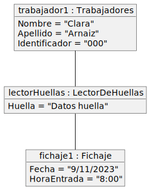

# Modelo del Dominio

Este documento describe los objetos principales de nuestro dominio, que incluyen: trabajador, lector de huellas, fichaje, informe, contrato, normas y horario. Se divide en varios componentes, cada uno presentando un aspecto diferente del modelo de dominio.

## Índice
1. [Diagrama de Clases](#diagrama-de-clases)
2. [Diagrama de Objetos](#diagrama-de-objetos)
3. [Diagrama de Estados](#diagrama-de-estados)

## Diagrama de Clases
El Diagrama de Clases ayuda a comprender las entidades del sistema y sus relaciones.

- [Código PUML](../../modelosUML/modeloDominio/diagramaClases.puml)

-----

## Diagrama de Objetos
El Diagrama de Objetos ilustra situaciones específicas de interacción entre objetos, como el fichaje diario y la creación de un informe semanal.

Ver Diagramas de Objetos

### Fichaje Diario
| Descripción | Diagrama | Enlace PUML |
| :---: | :---: | :---: |
| Creación de un fichaje diario |  | [Código PUML](../../modelosUML/diagramasObjetos/diagramaObjetos001.puml) |

### Informe Semanal
| Descripción | Diagrama | Enlace PUML |
| :---: | :---: | :---: |
| Creación de un informe semanal |  | [Código PUML](../../modelosUML/diagramasObjetos/diagramaObjetos002.puml) |

----

## Diagrama de Estados
El Diagrama de Estados muestra las transiciones entre los estados fundamentales de un trabajador: trabajando y no trabajando.

Ver Diagrama de Estados

- [Código PUML](../../modelosUML/modeloDominio/diagramaEstados.puml)

